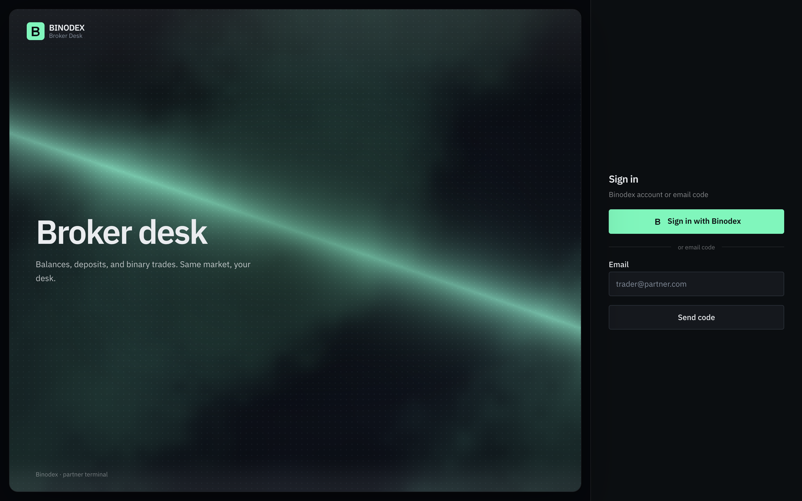

# Broker Desk



Partner trading terminal for [Binodex](https://binodex.app). Quotes, binary trades, deposit, withdraw — same market, your desk.

## Setup

1. Partner cabinet → **Broker API** → create a client. Copy `client_id`, `client_secret`, and the WebSocket URL (`https://broker-ws.binodex.app`).

2. Add the origin you will open and `{origin}/auth/callback`. Local example:

   - origin: `http://127.0.0.1:3040`
   - redirect: `http://127.0.0.1:3040/auth/callback`

3. Configure the app:

```
cp .env.example .env.local
```

Fill these in `.env.local`:

```
BROKER_CLIENT_ID=
BROKER_CLIENT_SECRET=
BROKER_WS_URL=https://broker-ws.binodex.app
```

Do not commit `.env.local`.

4. Run:

```
npm i
npm run dev
```

Open `http://127.0.0.1:3040`. Sign in with a Binodex account or an email code.

Production: whitelist your public origin and `{origin}/auth/callback` on the client, then `npm run build && npm start`.

Broker Desk v1.00

Next.js 16 · React 19 · TypeScript · Tailwind CSS 4 · Socket.IO · [Lightweight Charts](https://tradingview.github.io/lightweight-charts/)
